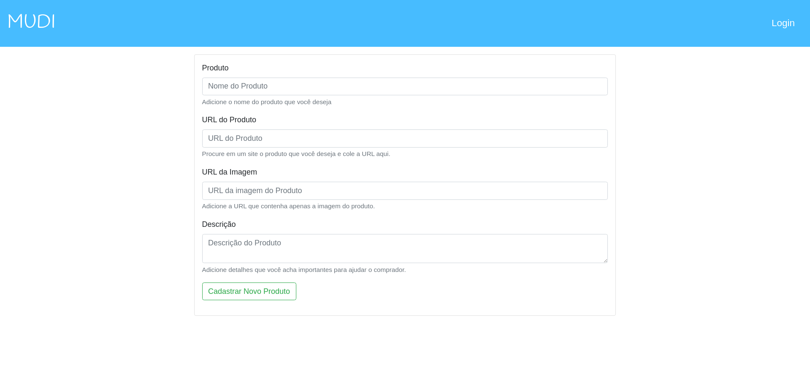
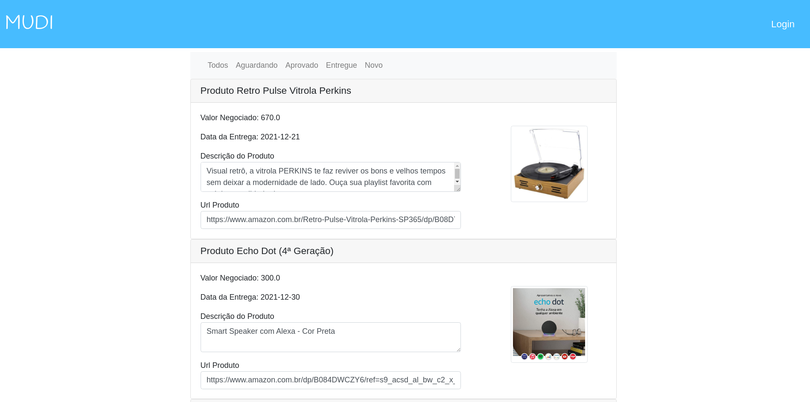

# Mudi
Aplicativo web de pedidos de produtos, para viajantes

### Como fazer o Pedido?
Você adiciona a url que contenha a imagem do  produto, 
a url do site onde tenha o seu produto e uma descrição que ajude o comprador.

### Telas da aplicação
As imagens abaixo ilustram como a aplicação está estruturada.
##### Cadastro de Produto
Onde é realizado o cadastro de novos produtos.

##### Lista todos os Produtos
Mostra todos os produtos que foram pedidos e os seus status.
