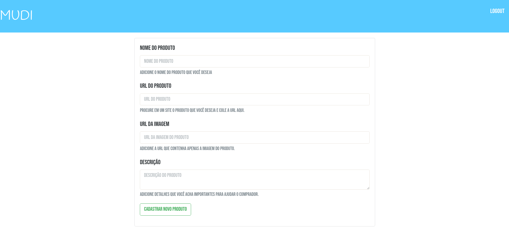
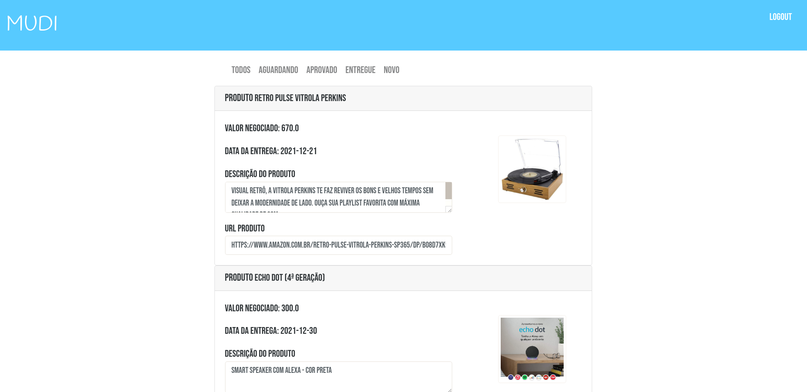
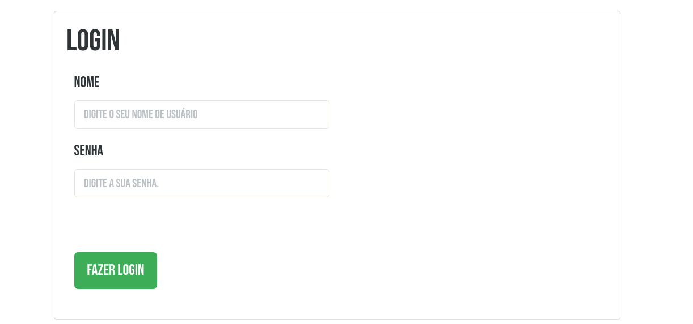
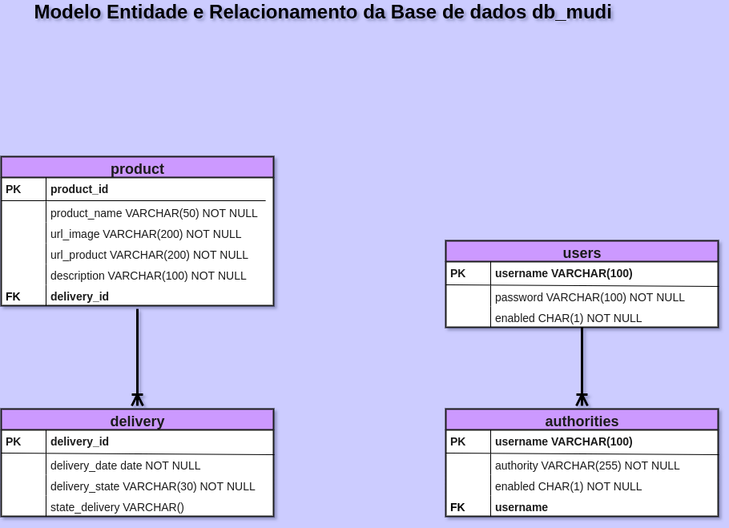

# Mudi
Aplicativo web para realizar pedidos de produtos para outros usuários que estejam viajam é combinado 
um valor a ser pago e o produto é enviado para o comprador.

### Como fazer o Pedido?
Você adiciona a url que contenha a imagem do produto, a url do site onde tenha o seu produto e uma 
descrição que ajude o comprador a encontrar o produto com mais facilidade.

### Telas da aplicação
As imagens abaixo é possível visualizar como são as telas da aplicação e o que cada tela faz.

##### Cadastro de Produto
Tela onde é realizado o cadastro de novos produtos.

  

##### Lista de Produtos do Usuário
Após realizar o login na aplicação a tela home é mostrada os produtos do usuário que está logado,
divididos nas seguintes categorias(AGUARDANDO, ENTREGUE eTODOS) a apção NOVO é para solicitar
um novo produto.

  

##### Login
Tela em que usuarios já cadastrados pode acessar a aplicação.

  

##### Cadastro de Usuário
Para novos usuários terem acesso aplicação é preciso fazer o cadastro.
[Cadastro de Usuário](images-views/register-user.png)
  

##### Modelo Entidade e Relacionamento
A imagem abaixo ilustra o relacionamento entre as entidades do banco de dados.

  